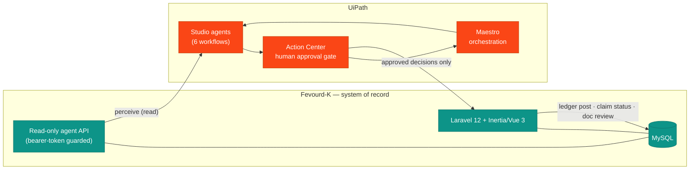
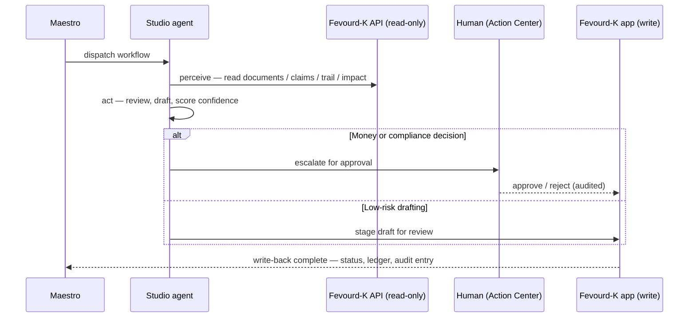
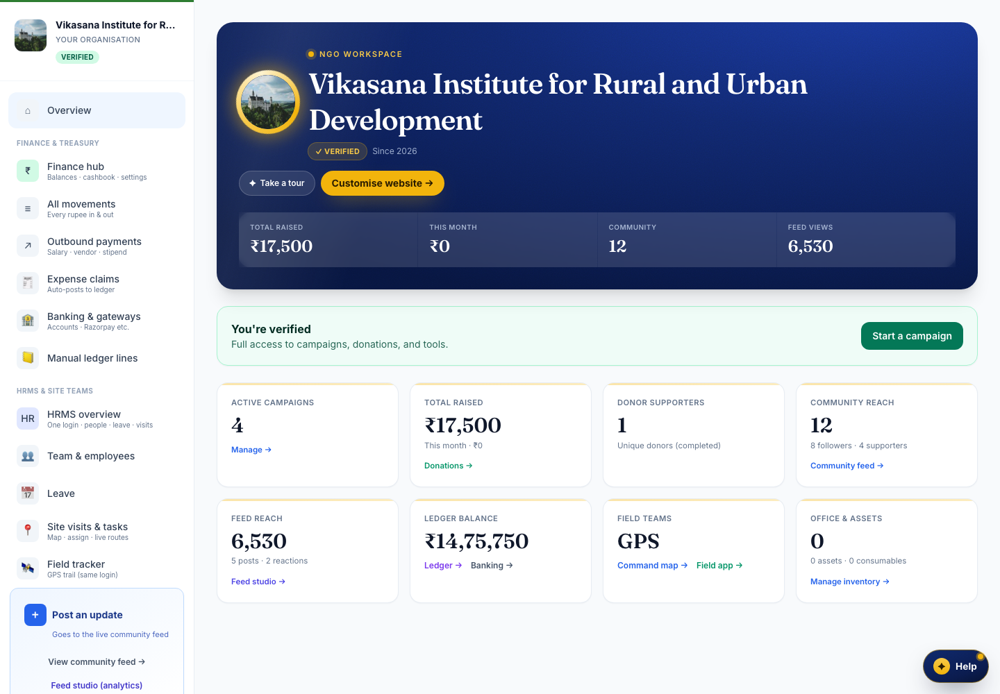
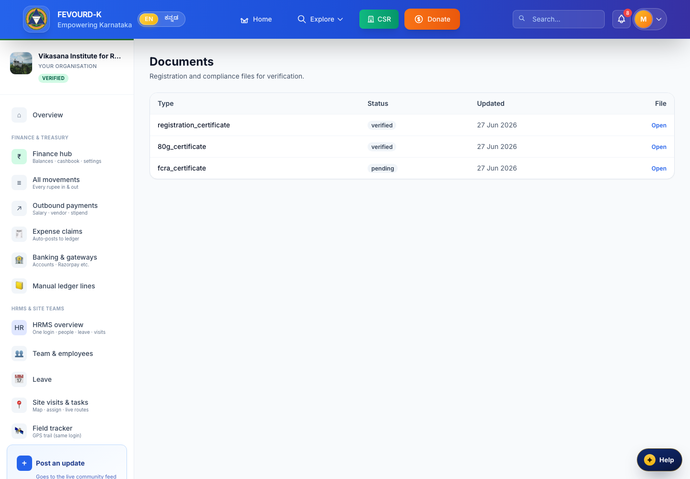
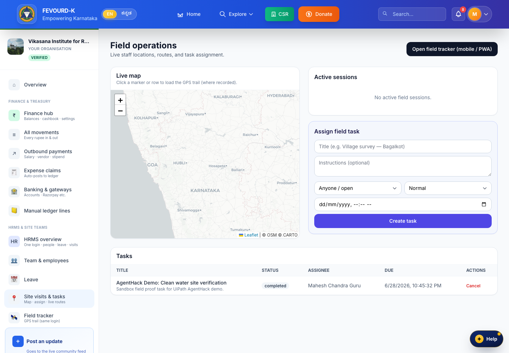
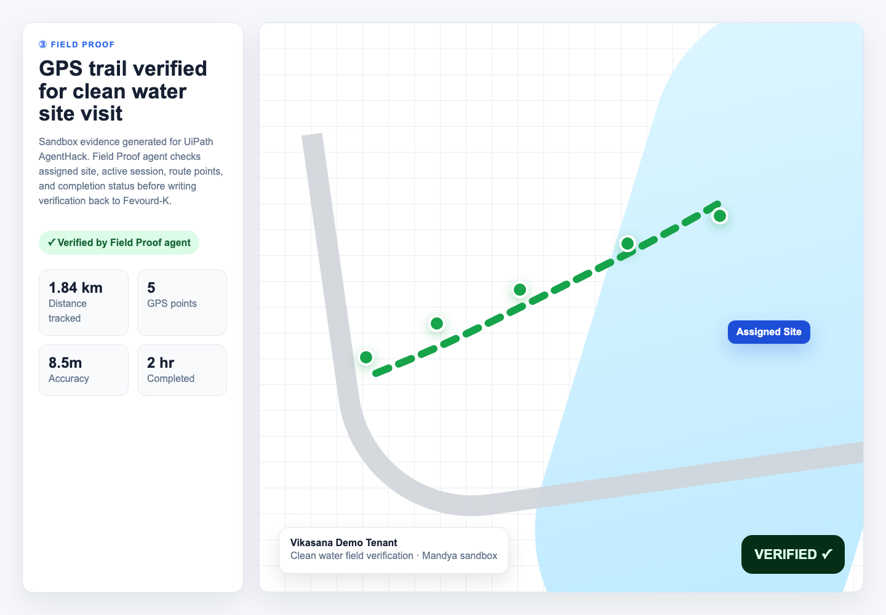
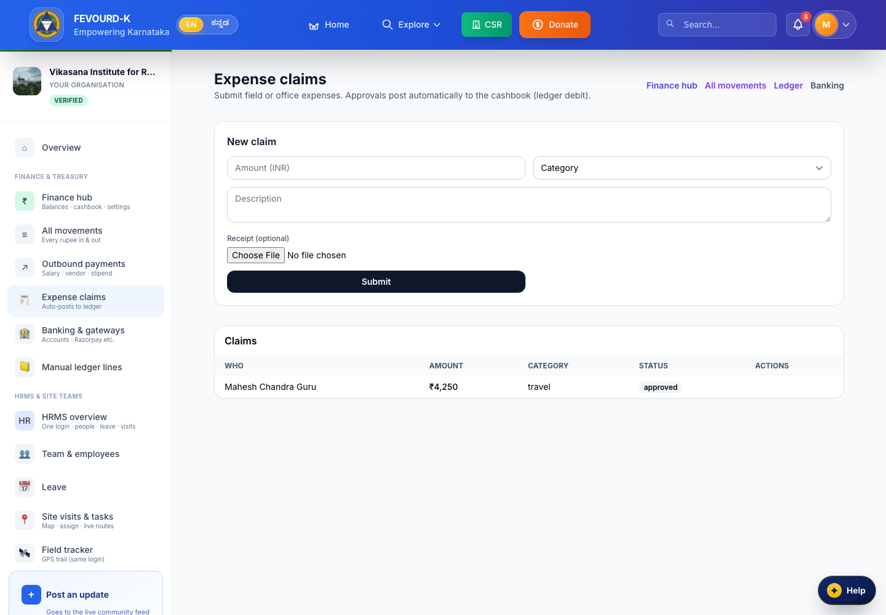
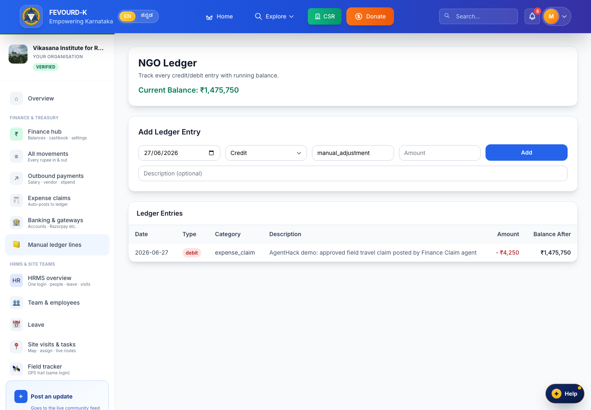
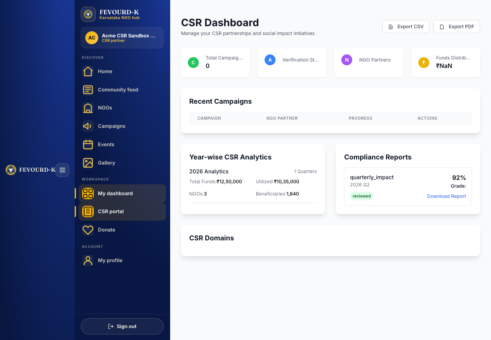
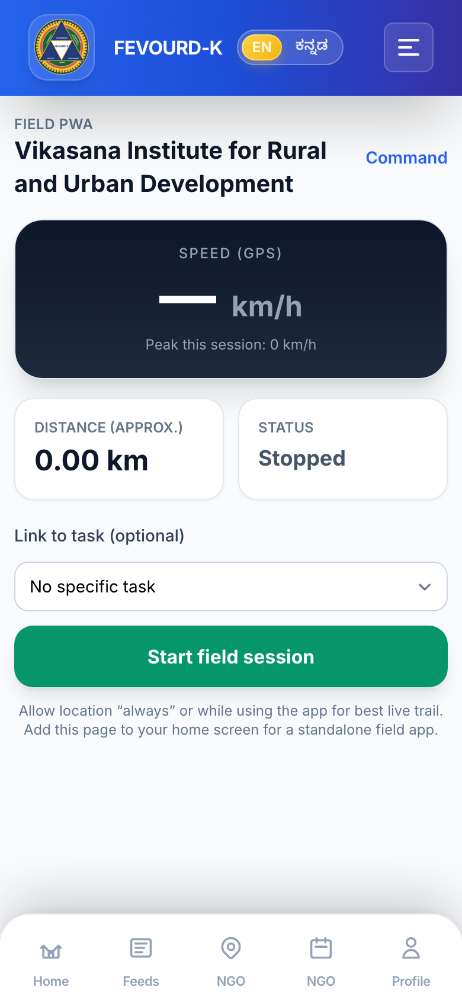

<div align="center">

# Fevourd-K × ImpactOps Maestro

### The NGO/CSR system of record — with a UiPath agentic back-office bolted on.

Less paperwork, more clean water.

[](https://laravel.com)
[](https://vuejs.org)
[](https://www.php.net)
[](https://www.mysql.com)
[](https://www.uipath.com)
[](LICENSE)
[](https://fevourdk.online)

**[Live demo](https://fevourdk.online)** ·
**[Deck](docs/agenthack-deck.pptx)** ·
**[Demo video script](docs/agenthack-demo-video-script.md)** ·
**[Devpost](docs/agenthack-devpost-FINAL.md)** ·
**[Submission index](docs/agenthack-SUBMISSION-INDEX.md)** ·
**[Enterprise](docs/ENTERPRISE.md)**

</div>

---

## What & why

**Fevourd-K** is a production NGO/CSR engagement platform — the **system of record** for campaigns,
field proof, finance claims, immutable ledgers, and compliance documents. It never acts as a financial
intermediary: every NGO uses its own payment gateway, and the platform never pools or holds money.

**ImpactOps Maestro** is the UiPath agentic layer that sits *on top* of that system of record. Small NGOs
drown in back-office paperwork — compliance reviews, expense claims, field-proof checks, CSR reports — that
eats the hours that should go to the field. ImpactOps Maestro lets UiPath agents do the repeatable reading
and drafting, and escalates only the two things humans must own: **money and compliance**. Fevourd-K stays
the source of truth; agents read through a guarded read-only API and write back only through the same
human-approved app routes a staffer would use.

The result: less paperwork, more clean water.

> **AgentHack 2026 submission.** This is a hybrid agentic process — UiPath **Maestro** orchestrates the
> workflow and human approvals, UiPath **Studio** agents execute the repeatable work, **Action Center** is
> the approval gate, and Fevourd-K (Laravel + Vue) is the operating portal and API.

---

## How it works



Agents **read** through the read-only API. They **never** write directly to the database — every write
(claim decision, ledger post, document review) flows back through Fevourd-K's authenticated, audited app
routes, so the human-in-the-loop and the audit trail stay intact.

### The agentic loop



> Escalation is deliberate, not incidental: **only money and compliance** decisions are routed to a human.
> Everything else (reviewing evidence, drafting copy, assembling reports) is staged for a quick human glance.

---

## The six workflows

| Workflow | What the agent does | Escalates to a human | Writes back to Fevourd-K |
|---|---|---|---|
| **Compliance Review** | Reads NGO/CSR documents, flags missing or expiring items, drafts findings | Any compliance status change | Document review status (via app route) |
| **Campaign Draft** | Reads campaign + feed data, drafts campaign/social updates | — (review-only staging) | Staged draft for staff to publish |
| **Field Proof** | Checks field-session evidence, GPS trail points, completion status | Disputed / incomplete proof | Session verification status |
| **Finance Claim** | Reads expense claims, validates against policy, routes for approval | **Every claim decision (money)** | Approved claim → NGO ledger post |
| **CSR Report** | Assembles CSR impact + compliance summaries for corporate users | Sign-off on published figures | CSR report artifact |
| **ImpactOps Maestro** | Orchestrates the above, sequences handoffs, tracks state | Gate-level approvals | Cross-workflow status + audit trail |

Full orchestration detail: **[docs/agenthack-orchestration.md](docs/agenthack-orchestration.md)** ·
UiPath manifest: **[uipath/README.md](uipath/README.md)** ·
[uipath/orchestrator-manifest.md](uipath/orchestrator-manifest.md).

---

## The agent API

A small, **read-only**, bearer-token-guarded surface (`routes/api.php`,
`App\Http\Controllers\Api\ImpactOpsApiController`). Writes are intentionally *not* exposed here.

| Method | Path | Purpose |
|---|---|---|
| `GET` | `/api/health` | Liveness + mode check (`read-only`) |
| `GET` | `/api/ngo/{ngo}/documents` | Compliance documents + verification status |
| `GET` | `/api/ngo/{ngo}/campaigns/{campaign}` | Campaign progress (raised / target / donors / status) |
| `GET` | `/api/ngo/{ngo}/finance/claims` | Recent expense claims (claimant, amount, status) |
| `GET` | `/api/ngo/{ngo}/csr/impact` | CSR roll-up: verified sessions, approved spend, ledger balance, SDGs |
| `GET` | `/api/field/sessions/{id}/trail` | Field-session GPS trail summary (points, distance, status) |

### Sample call

```bash
# Token is masked — pass your own bearer token (config: services.uipath.token)
export TOKEN="••••••••••••••••"

curl -s https://fevourdk.online/api/ngo/vikasana/campaigns/clean-water-for-mandya \
  -H "Authorization: Bearer $TOKEN" \
  -H "Accept: application/json"
```

```jsonc
// Demo data: NGO "Vikasana", campaign "Clean Water for Mandya"
{
  "title": "Clean Water for Mandya",
  "slug": "clean-water-for-mandya",
  "raised": 512000,     // ₹5.12L
  "target": 800000,     // of ₹8L
  "donor_count": 1,
  "status": "active"
}
```

Deploying this API to production: **[docs/agenthack-deploy-api-to-prod.md](docs/agenthack-deploy-api-to-prod.md)**.

---

## Screenshots

| | |
|---|---|
|  |  |
| **NGO dashboard** — the operating portal | **Compliance documents** — what the agent reviews |
|  |  |
| **Field proof hub** — evidence + sessions | **GPS trail** — the field-proof signal agents read |
|  |  |
| **Finance claims** — money, always human-approved | **Ledger write-back** — approved claim posts to the ledger |
|  |  |
| **CSR dashboard** — impact roll-up for corporates | **Mobile field app** — proof capture in the field |

---

## Installation & setup

### Prerequisites
- PHP 8.2+
- Composer
- Node.js & NPM
- MySQL 8+ / MariaDB (XAMPP works fine)
- Redis (optional — cache & queues)

### Steps

```bash
# 1. Clone
git clone https://github.com/vikas-guru/fevourdk.git
cd fevourdk

# 2. Install dependencies
composer install
npm install

# 3. Environment
cp .env.example .env
php artisan key:generate

# 4. Database — create a MySQL DB, set DB_* in .env (default connection: mysql)
php artisan migrate --seed

# 5. Run (local dev runs on :8080)
php artisan serve --port=8080
npm run dev      # Vite, in another terminal
```

### Demo / showcase accounts

After seeding, the **Vikasana** NGO showcase is preloaded — real demo campaign
**"Clean Water for Mandya"** (₹5.12L of ₹8L raised). Log in from the home page and use
**OTP `1234`** for any demo account. To reset the demo data at any time:

```bash
php artisan migrate:fresh --seed
```

Seeders that matter:
- `VikasanaShowcaseSeeder` — showcase NGO + campaign + field proof + finance + CSR data
- `RolePermissionSeeder` — the 8 RBAC roles (Spatie)
- `EnsureDemoNgoAdminSeeder` — demo NGO admin login

---

## Enterprise & scale

Multi-NGO tenancy, SSO/SCIM, immutable audit + Indian NGO/CSR compliance exports (FCRA, 80G, CSR-2),
human-in-the-loop at scale with agent confidence scoring, white-label microsites, and deployment options
(managed cloud / private cloud / on-prem) are covered in **[docs/ENTERPRISE.md](docs/ENTERPRISE.md)**.

---

## Tech stack

| Layer | Choice |
|---|---|
| Backend | Laravel 12, PHP 8.2+, REST/JSON, queue workers |
| Frontend | Inertia.js, Vue 3, Tailwind CSS, PWA |
| Database | MySQL 8+ / MariaDB (Redis optional for cache + queues) |
| Auth | Spatie Laravel Permission — 8-role RBAC |
| Agentic layer | UiPath Maestro (orchestration), Studio (agents), Action Center (approvals) |
| Mobile | PWA-first; Android TWA, iOS WebView |
| i18n | EN ⇄ ಕನ್ನಡ (Kannada) on the public microsite |

### The 8 roles
Super Admin · State Admin · NGO Admin · NGO Staff · Corporate CSR Manager · Donor · Vendor · Volunteer.

---

## Roadmap

- **Now** — system of record live at [fevourdk.online](https://fevourdk.online); read-only agent API; 6 UiPath workflows; bilingual microsite.
- **Next** — deploy the agent API to production; per-NGO Orchestrator folders + approval routing; agent confidence thresholds with auto-approve for low-risk drafting; a trust dashboard of every agent action and who approved it.
- **Later** — SSO/SCIM and scoped admins; accounting integrations (Tally/Zoho/SAP); donor CRM sync; data-residency and on-prem deployment options.

See **[docs/agenthack-orchestration.md](docs/agenthack-orchestration.md)** and **[docs/ENTERPRISE.md](docs/ENTERPRISE.md)** for the full picture.

---

## License

MIT — see [LICENSE](LICENSE).

---

<div align="center">

**Fevourd-K × ImpactOps Maestro** — digital infrastructure for social impact, built for trust, compliance, and scale.

Built for **UiPath AgentHack 2026** · [Live demo](https://fevourdk.online) · [Submission index](docs/agenthack-SUBMISSION-INDEX.md)

</div>
