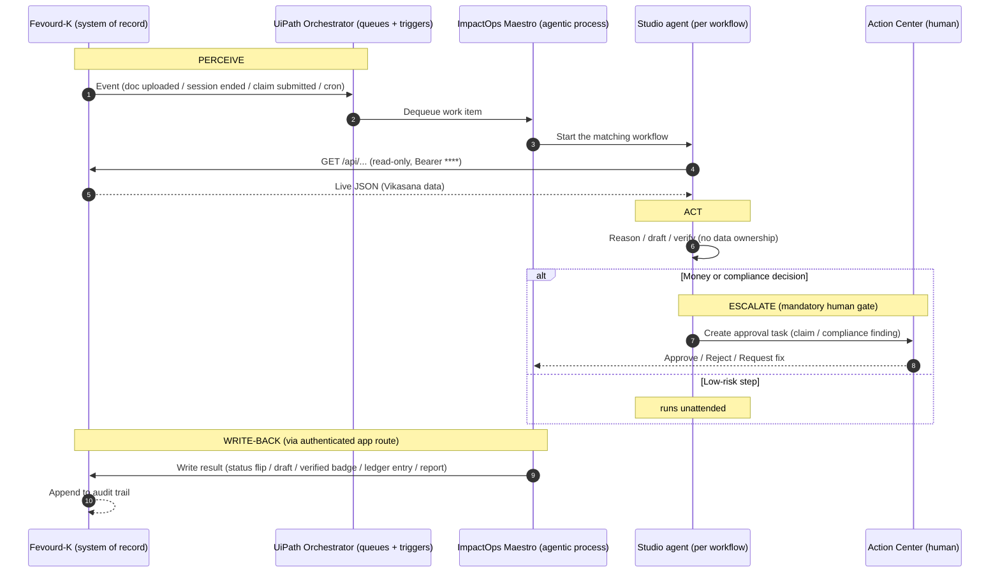

# ImpactOps Maestro — Orchestration Walkthrough (judge-facing)

How the **UiPath ImpactOps Maestro** agentic process runs NGO/CSR back-office operations on top of
**Fevourd-K** (the system of record). Every workflow is the same honest loop:

> **perceive** (read the live Fevourd-K agent API) → **act** (agent reasons/drafts) →
> **escalate** (money + compliance go to a human in UiPath Action Center) → **write-back**
> (result lands in Fevourd-K, audit trail intact).

- **Live demo (sandbox / product portal):** https://fevourdk.online/ (HTTP 200 now).
- **Agent API base:** `https://fevourdk.online/api` (token-guarded; live after the API deploy —
  see `docs/agenthack-deploy-api-to-prod.md`). Local fallback: `http://127.0.0.1:8080/api`.
- **Auth:** `Authorization: Bearer ****` (masked everywhere; env `UIPATH_AGENT_TOKEN`,
  sandbox default `sandbox-impactops-demo-token`).
- **Demo NGO:** `vikasana` · **flagship campaign:** "Clean Drinking Water for Mandya Villages".

The six read endpoints are real and read-only. **Writes never go through the agent API** — they go
through Fevourd-K's existing authenticated app routes, so the human-in-the-loop and the audit trail
stay in one system. The two write decisions that touch **money or compliance are always gated by a
human** in Action Center; everything else runs unattended on queues + triggers.

---

## End-to-end orchestration sequence



---

## The six workflows — worked examples (real Vikasana data)

Each example uses the seeded "Clean Water for Mandya" demo. JSON shapes match the live API surface;
exact values come from the seeded sandbox.

### ① Compliance Review
- **Perceive** — `GET /api/ngo/vikasana/documents`
  ```json
  { "ngo": "vikasana", "documents": [
    { "id": 12, "type": "registration_certificate", "status": "verified", "verified_at": "2025-04-01" },
    { "id": 13, "type": "80g_certificate",          "status": "verified", "verified_at": "2025-04-01" },
    { "id": 14, "type": "fcra_certificate",         "status": "pending",  "verified_at": null }
  ] }
  ```
- **Act** — agent flags the `pending` FCRA certificate: missing verification, blocks foreign-donor
  campaigns. Drafts a finding + recommended action ("verify or renew before accepting FCRA-tagged funds").
- **Escalate** — Action Center task `Compliance finding — sign-off` to a compliance officer
  (NGO, document, finding, recommendation → **Approve / Request fix**).
- **Write-back** — officer signs off → Fevourd-K document review set to `Reviewed` with the finding
  attached, `source: ImpactOps Maestro`. Compliance dashboard updates; audit trail records who approved.

### ② Campaign Draft
- **Perceive** — `GET /api/ngo/vikasana/campaigns/clean-drinking-water-for-mandya-villages`
  ```json
  { "title": "Clean Drinking Water for Mandya Villages",
    "slug": "clean-drinking-water-for-mandya-villages",
    "raised": 512000, "target": 800000, "donor_count": 184, "status": "active" }
  ```
- **Act** — agent computes progress (64% funded) and drafts a donor/CSR update:
  *"64% funded — ₹5.12L raised toward clean water for Mandya villages, 184 donors. Help us reach the
  last ₹2.88L. #CleanWater #Vikasana"*. It is a **draft only** — never auto-posted.
- **Escalate** — soft review: the draft lands in Feed Studio flagged `requires_human_review: true`.
  (Not a money/compliance gate, so no Action Center task — a marketing owner publishes from the app.)
- **Write-back** — `status: draft` post created in Fevourd-K Feed Studio via the authenticated route,
  `source: ImpactOps Maestro`.

### ③ Field Proof
- **Perceive** — `GET /api/field/sessions/4471/trail`
  ```json
  { "session_id": 4471, "status": "completed", "active": false,
    "started_at": "2026-06-20T09:12:00+05:30", "ended_at": "2026-06-20T11:40:00+05:30",
    "points": 38, "distance_meters": 2150 }
  ```
- **Act** — agent verifies the evidence is checkable, not narrated: session completed, 38 GPS points,
  2.15 km trail consistent with the assigned Mandya site. Confidence high → mark the task verifiable.
- **Escalate** — unattended (no money/compliance). If the trail were sparse or off-site, it would route
  to a field supervisor instead of auto-verifying.
- **Write-back** — field task badge set to `Verified` with the reason ("active completion + GPS trail of
  38 pts matches assigned site"), `source: ImpactOps Maestro`.

### ④ Finance Claim — the bidirectional proof point
- **Perceive** — `GET /api/ngo/vikasana/finance/claims`
  ```json
  { "ngo": "vikasana", "claims": [
    { "id": 2207, "claimant": "M. C. Guru", "amount": 4250, "currency": "INR",
      "category": "travel", "status": "submitted" } ] }
  ```
- **Act** — agent checks the claim against the budget line and the `finance-approval-threshold` asset
  (₹5000). Below threshold *and* receipt present → it can recommend; for the demo every money decision
  is routed to a human regardless.
- **Escalate** — Action Center task `Finance claim — approve/reject` (claimant, amount, budget line,
  receipt, policy check → **Approve / Reject**). **Money always routes to a person.**
- **Write-back** — on **Approve**, Fevourd-K posts a ledger entry via the authenticated route:
  ```json
  { "decision": "approved",
    "ledger_entry": { "type": "debit", "category": "expense_claim", "amount": 4250,
      "description": "Approved field travel claim posted by Finance Claim agent",
      "balance_after": 1475750 },
    "source": "ImpactOps Maestro" }
  ```
  Claim → human decision → posted ledger entry, end to end. On **Reject**, the claim is returned with
  the reviewer's note and no ledger movement.

### ⑤ CSR Report
- **Perceive** (aggregate) — `GET /api/ngo/vikasana/csr/impact`
  ```json
  { "ngo": "vikasana", "verified_field_sessions": 12, "approved_spend": 1475750,
    "ledger_balance": 1475750, "compliance_pending": 1, "sdg": ["SDG 6"] }
  ```
- **Act** — on the quarterly cron, the agent assembles one CSR impact + compliance summary: verified
  field proof, approved spend, ledger balance, the 1 outstanding compliance item, and SDG 6 alignment.
- **Escalate** — unattended assembly; the CSR owner reviews the artifact before sharing externally.
- **Write-back** — a CSR report artifact (`status: ready`, `traceable: true`) is created in Fevourd-K,
  `source: ImpactOps Maestro`. Every number traces back to a verified field session, an approved claim,
  or a reviewed document.

### ⑥ ImpactOps Maestro Agentic Process
The Maestro process is the conductor: it owns the handoffs and the two human-approval nodes across
workflows ①–⑤, but **never owns the data**. It dequeues work, starts the right Studio agent, holds the
Action Center gates for money/compliance, and routes every result back into Fevourd-K. See the sequence
diagram above.

---

## How UiPath calls the live API (real curl)

Token masked. Set the real value in the Orchestrator credential asset / `UIPATH_AGENT_TOKEN`.

```bash
BASE="https://fevourdk.online/api"   # local fallback: http://127.0.0.1:8080/api
TOKEN="****"                          # never commit/publish the real value

curl -s -H "Authorization: Bearer $TOKEN" "$BASE/health"
curl -s -H "Authorization: Bearer $TOKEN" "$BASE/ngo/vikasana/documents"
curl -s -H "Authorization: Bearer $TOKEN" "$BASE/ngo/vikasana/campaigns/clean-drinking-water-for-mandya-villages"
curl -s -H "Authorization: Bearer $TOKEN" "$BASE/ngo/vikasana/finance/claims"
curl -s -H "Authorization: Bearer $TOKEN" "$BASE/ngo/vikasana/csr/impact"
curl -s -H "Authorization: Bearer $TOKEN" "$BASE/field/sessions/4471/trail"
```

- Valid token → `200` JSON. Missing/invalid token → `401 {"error":"unauthorized"}`.
- Until the API is deployed to prod, `https://fevourdk.online/api/health` returns `404` — use the local
  base meanwhile (`php artisan serve` on `:8080`).

---

## Roadmap — 2 extension workflows (clearly labeled, not yet built)

Same `perceive → act → escalate → write-back` shape, truthful to the actual API model
(read via a new read-only agent endpoint; **money/compliance writes stay human-gated**).

### ⑦ Donor Reconciliation (roadmap)
- **Perceive** — read settled donations + the NGO ledger (new read endpoint, e.g.
  `GET /api/ngo/vikasana/finance/donations`) and the latest gateway settlement export.
- **Act** — match each gateway payout line to a Fevourd-K donation; flag mismatches (missing receipt,
  amount drift, duplicate, unattributed payout).
- **Escalate** — any unmatched amount or money discrepancy → Action Center `Reconciliation exception`
  for a finance officer (this is a money decision, so it is gated).
- **Write-back** — matched donations marked `reconciled` and a reconciliation summary written to the
  ledger via the authenticated route; exceptions returned with the reviewer's resolution.

### ⑧ Grant Milestone Tracking (roadmap)
- **Perceive** — read a grant's milestone schedule + the verified field/finance evidence behind each
  milestone (new read endpoint, e.g. `GET /api/ngo/vikasana/grants/{id}/milestones`).
- **Act** — for each due milestone, check whether the required verified field sessions and approved
  spend exist; draft the funder progress note.
- **Escalate** — "mark milestone complete / release next tranche" is a money + compliance decision →
  Action Center gate for the grants officer.
- **Write-back** — milestone status flipped (`met` / `at_risk`) and the funder note saved as a draft in
  Fevourd-K; tranche release only after human approval, with the decision in the audit trail.

---

**The architecture story in one line:** Fevourd-K never loses control of the data; UiPath never makes
the money or compliance decision alone.
